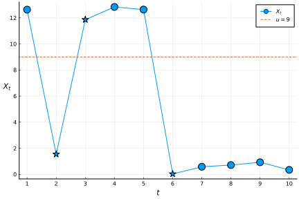
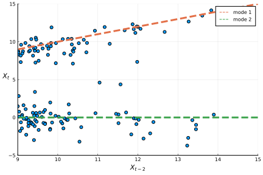
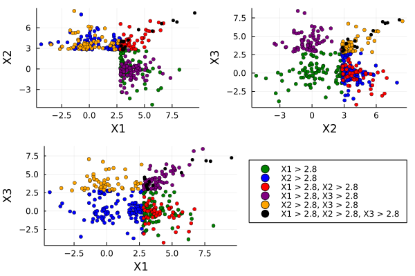
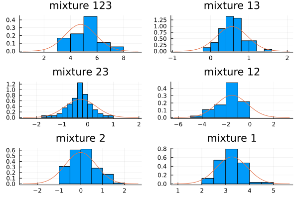

# A 6-mixture extreme value model

Consider a time series $X_t | X_{t-1}=y, X_{t-2}=x \sim F(x,y,\cdot)$ that
exhibits _tail switching_[^1]. It is easiest to demonstrate what tail switching
means graphically:

{.inlinegraph}

In the figure, the series tail switches around $u=9$ at $t=2,3$ and $6$ (denoted
by the $\star'\text{s}$).

I am interested in inferring $F$, when either $x$ or $y$ (or both) are large,
from some time series data, with the hope that this could help to characterize
how the process tail switches.

## Thoughts on modelling

As discussed, we would like to model the distribution of $X_t | X_{t-1}=y,
X_{t-2}=x$, where either $x$ or $y$ are large. It is not immediately obvious how
to do this, though we will assume stationarity for now, which gives:

$$
X_t | X_{t-1}=y, X_{t-2}=x \sim F
\implies X_3 | X_{2}=y, X_{1}=x \sim F.
$$

In other words, we don't worry about where we are temporally in the
process. The stationarity assumption also gives us a lot more data to fit a
model. To be clear, if we have one realization of a time series $\{X_t\}_{t=1}^n$,
we'd use the following dataset $\mathcal{D}$ to fit a model for $F$

$$
\mathcal{D} = \{(X_t,X_{t-1},X_{t-2})\, |\, t=1:n, \text{ one of }X_{t-1},\,X_{t-2} \text{ large}\}.
$$

### Model idea 1

If we were instead interested in the distribution $X_3,X_{2}:=\vec X_{-1} |
X_{1}=x$ where $x$ is large, then we could try[^2] and fit a [Heffernan-Tawn
model](https://doi.org/10.1111/j.1467-9868.2004.02050.x).
This suggests the following model may work for our problem:

$$
\begin{aligned}
X_3 | X_2=y,X_1=x \sim \begin{cases}
F_{12} & \text{ if both } x,y \text{ large }\\
F_{1} & \text{ if only } x \text{ large }\\
F_{2} & \text{ if only } y \text{ large }.\\
\end{cases}
\end{aligned}
$$

The last two cases now fit nicely into the Heffernan-Tawn framework, and we can
fit HT mixture models for $F_1$ and $F_2$, ignoring $y$ and $x$ (the
non-extreme values) respectively. For example to obtain $\hat F_1$ we could fit
parameters $\vec\alpha,\vec\beta,\pi,\vec \mu, \vec \sigma$ on the dataset
$\{(x,y,z)\in \mathcal{D}\,|\,y \text{ not large}\}$:

$$
\begin{aligned}
{X_3}| X_2=y, X_1=x &\sim \pi_1 &N\left(\mu_1 x^{\beta_1} + \alpha_1 x, \sigma^{2}_{1}
x^{2 \beta_1}\right)\\
             &+(1-\pi_1)&N\left(\mu_2 x^{\beta_2} + \alpha_2 x,
             \sigma^{2}_{2} x^{2 \beta_2}\right)
\end{aligned}
$$

The idea is that each mixture on the RHS captures one of the _modes_ of the
distribution on the LHS. The two modes here are supposed to correspond to the
two cases (a) extreme or (b) not extreme. For example:

{.inlinegraph}

In general, unfortunately, $F_{12}$ is difficult to fit, as there is no
simple general form (citation needed) for normalizing constants $a=a(x,y)$, $b=b(x,y)>0$
such that the following non-degenerate limit exists:

$$
\frac{X_3 - a(x,y)}{b(x,y)} \bigg| X_2=y,X_1=x \rightarrow G, \text{ as
}x,y\rightarrow\infty.
$$

Another downside of this approach, even supposing we had an idea about how to
model $F_{12}$, is that we are perhaps being statistically inefficient by
fitting each of the $F_i$ on a subset of $\mathcal{D}$.

### Model idea 2

Another idea is to observe that $\mathcal{D}$ partitions naturally into $2^3=8$
sets, based on whether each component of $\vec x \in \mathcal{D}$ is large or
not:

$$
\begin{aligned}
\mathcal{D} &= \bigcup_{i,j,k\in\{+,\,-\}} \mathcal{D}_{i,j,k}\\
(\text{e.g. } \mathcal{D}_{+,-,+} &= \{\vec x \in \mathcal{D}\,|\,
x_1,\,x_3\text{ large},\, x_2\text{ not large}\})
\end{aligned}
$$

Note that $\mathcal{D}_{-,-,+} =\mathcal{D}_{-,-,-} = \emptyset$, so
$\mathcal{D}$ actually partitions into 6 sets.

Then, we suppose that each of these 6 sets corresponds to a mode of $X_3 |
X_2=y,X_1=x$ (after some normalization, given by normalizing $a$'s and $b$'s),
giving us the following 6-mixture model:
<div id="general-6-mixture"></div>

$$
\begin{aligned}
\prob\left(X_3 \leq z | X_2=y,X_1=x\right) &\sim  \pi_{123} G_{123}\left(\frac{z
- a_{123}(x,y)}{b_{123}(x,y)}\right)\\
                         &+     \pi_{13} G_{13}\left(\frac{z - a_{13}(x)}{b_{13}(x)}\right)\\
                         &+     \pi_{23} G_{23}\left(\frac{z - a_{23}(y)}{b_{23}(y)}\right)\\
                         &+     \pi_{12} G_{12}\left(\frac{z - a_{12}(x,y)}{b_{12}(x,y)}\right)\\
                         &+     \pi_{2} G_{2}\left(\frac{z - a_2(y)}{b_2(y)}\right)\\
                         &+     \pi_{1} G_{1}\left(\frac{z - a_1(x)}{b_1(x)}\right)\\
\text{ such that } \pi_1+\cdots+\pi_{123} = 1.
\end{aligned}
$$

$G_{1}$ and $G_{13}$ correspond to the modes when $X_1$ is large but $X_2$
is not, and so on. Note the subtle assumptions $a_1(x,y) = a_1(x)$, $b_1(x,y) = b_1(x)$:
if $X_1$ is large but $X_1$ is not, then
we assume the distribution of $X_3|X_2,X_1$ is independent of $X_1$. I am not
sure yet whether these assumptions are sensible.


## Fitting a simple version of this model to asymmetric logistic data

As an example, we attempt to fit the 6-mixture model above to data drawn from an
asymmetric logistic model. The parameters used were

- $M=1000$, $N=30$
- $u=2.8$, $v=9$
- $\theta_0=\theta_1=\theta_2=\theta_{01}=\theta_{02}=0.3$, $\theta_{012}=0.1$
- $v_{01}=v_{02}=v_{012}=0.5$

### Procuring data for fitting

The drawing procedure is, for $m=1:M$[^3],

1. draw $X_1^m$ from $X_1\,|\,X_1 > v$, $X_1\sim$ Fréchet(1)
2. draw $X_2^m$ from $X_2\,|\,X_1=X_1^m$
3. draw $X_t^m$ from $X_3\,|\,X_{2}=X_{t-1}^m,X_1=X_{t-2}^m$, $t=3:N$,

where the conditionals are defined by the joint distribution

$$
\begin{aligned}
&(X_1,X_2,X_3) \sim F\\
&F(x,y,z) = \exp(-V(x,y,z))\\
\end{aligned}
$$
$$
\begin{aligned}
V(\vec x) &= \theta_0 x_0^{-1} + \theta_1 x_1^{-1} + \theta_2 x_2^{-1}\\
&+\theta_{01}\left\{(x_0^{-1/v_{01}} + x_1^{-1/v_{01}})^{v_{01}}
  + (x_1^{-1/v_{01}} + x_2^{-1/v_{01}})^{v_{01}}\right\}\\
&+\theta_{02}\left\{(x_0^{-1/v_{02}} + x_2^{-1/v_{02}})^{v_{02}}\right\}\\
&+\theta_{012}\left\{(x_0^{-1/v_{012}} + x_1^{-1/v_{012}} + x_2^{-1/v_{012}})^{v_{012}}\right\}\\
\\
&\theta_0+\theta_{01}+\theta_{02}+\theta_{012}=1\\
&\theta_1+2\theta_{01}+\theta_{012}=1\\
&\theta_2+\theta_{01}+\theta_{02}+\theta_{012}=1\\
&\vec v \lt 1.
\end{aligned}
$$

Next,

- construct $\mathcal{D}'' = \{(X_t^m,X_{t-1}^m,X_{t-2}^m)\,|\,m=1:M,t=3:N \}$
  ($\mathcal{D}''$ is a $(M(N-2))\times 3$ matrix)

- transform each margin to standard Laplace using the empirical CDF (adjusted by
  a factor to prevent us mapping to $\infty$):

$$
\begin{aligned}
\mathcal{D}' = \{(T_1(x_1),T_2(x_2),T_3(x_3))\,|\, \vec x \in \mathcal{D}''\}\\
T_i(x) = F_{\text{Laplace}}^{-1}\left(\frac{M(N-2)-1}{M(N-2)}\hat F_i(x)\right).
\end{aligned}
$$

Finally, select only the observations which are extreme in their first or second
components: $\mathcal{D} := \{(x,y,z)\in\mathcal{D}' \,|\, x > u \text{ or }  y > u\}$.

#### Data visualization

Here is a 2D visualization of the data

{.inlinegraph}

and a 3D one:

```{.include}
figures/plot_data_3d.js
```

### Fitting a simplified mixture with EM

Here, by $X_1,X_2,X_3$ we mean tuples from $\mathcal{D}$.

The [6-mixture model](#general-6-mixture) above is rather general, so we
fit something a bit simpler. In particular for the asymmetric logistic model, we
know the values of the $a$'s and $b$'s (see example 4[^4]
in [Papa&Tawn, Hidden tail chains...](https://arxiv.org/pdf/1903.04059.pdf)), so we fit:

$$
\begin{aligned}
\prob\left(X_3 \leq z | X_2=y,X_1=x\right) &\sim  \pi_{123} G_{123}\left(z- \lambda(x,y;v_{012})\right)\\
                         &+     \pi_{13} G_{13}\left(z - x\right)\\
                         &+     \pi_{23} G_{23}\left(z - y\right)\\
                         &+     \pi_{12} G_{12}\left(z\right)\\
                         &+     \pi_{2} G_{2}\left(z\right)\\
                         &+     \pi_{1} G_{1}\left(z\right)\\
\lambda(x,y;v) &= -v\log\left(\exp(-x/v) + \exp(-y/v)\right)
\end{aligned}
$$

We make the added assumption that each of the $G$'s are normal (i.e. we
assume with probability $\pi_{123}$ that $X_3 - \lambda(x,y;v_{012}) |X_2=y,X_1=x \sim
N(\mu,\sigma^2)$, and so on).

We can fit this using EM. Specifically, we can write the likelihood as

$$
\begin{aligned}
L(\theta\,|\, Z,X_1,X_2,X_3)=\\
\prod_i \bigg\{&\left[\pi_{123}\phi_{123}\left(x_3^i- \lambda(x_1^i,x_2^i;v_{012});\mu_{123},(\sigma^2)_{123}\right)\right]^{Z^i_{123}}\\\cdots
&\left[\pi_{1}\phi_{1}\left(x_3^i;\mu_{1},(\sigma^2)_{1}\right)\right]^{Z^i_{1}}\bigg\},
\end{aligned}
$$

where the $\phi$'s are normal densities, the $Z$'s are latent indicators
denoting the mixture component to which the $i$th observation belongs,
and $\theta$ is the set of parameters:
$\theta = (\pi_1,\ldots,\pi_{123},\mu_{123},\ldots,\mu_{1},(\sigma^2)_{123},\ldots,(\sigma^2)_{1})$.

An EM algorithm is then to iteratively maximize the marginal likelihood (or
equivalently the marginal log-likelihood)[^5]:

$$
\begin{aligned}
Q(\theta | \theta^{(t)}) &= \mathbb{E}_{Z|X_1,X_3,X_3,\theta^{(t)}}[\log L(\theta | Z,X_1,X_2,X_3)]\\
\theta^{(t+1)} &= \max_{\theta} Q(\theta | \theta^{(t)})
\end{aligned}
$$

Julia code which performs these iterations can be found [here](https://github.com/lippirk/sitegen/tree/main/edi_diss/extreme-value-6-mixture/Tmp.jl) (search
for `em_6_mixture`).

#### EM Results

First, we check that the residuals for each mixture component roughly match
the pdf of their model. It's not too bad:

{.inlinegraph}

We can also sample values from the model $X_3 | X_2,X_1$, and the marginal
distribution of these samples with the true distribution of $X_3$ (according
to the data). The sampling procedure is:

- for each pair $(X_1,X_2)$, sample $X_3$ from each mixture component (this
  gives 6 copies of $X_3$);
- select the $k$th with probability $\hat\pi_k$, discarding the other 5;
- repeat some number of times.

The result is that simulated samples from the model tend to overemphasize
the two modes:

{.inlinegraph}

This makes sense when we look at the inferred parameters.
Row `5` and row `6` contribute over half (`0.35+0.21`) of the mixture weight,
and are 'sharp' (low standard deviation), corresponding to the two 'sharp' modes

```{.julia}
     │ π           π'       μ           σ
─────┼───────────────────────────────────────────
   1 │ 0.0403733   0.0475   4.76147     1.16725
   2 │ 0.121441    0.18     0.556264    0.406117
   3 │ 0.134245    0.18    -0.271871    0.603022
   4 │ 0.135536    0.1225  -1.18627     1.38862
   5 │ 0.354686    0.3125  -0.00221509  0.692631
   6 │ 0.213718    0.1575   3.26697     0.64683
```

NB. the difference between the columns `π` and `π'` is that `π` was found by the EM
algorithm, whereas `π'` was found by assigning each observation to their closest
mixture components, and calculating proportions. We may need to run the EM
algorithm for longer (it is unfortunately quite slow since we are optimizing
over 17 parameters) to see `π` and `π'` converge. Using `π'` rather than `π`
to generate the $X_3$ sample may reduce the overemphasis of the modes (but I
haven't tried this yet).

[^1]: One example of such a time series is one generated by the asymmetric logistic
model (details of this model, and how to draw from it, are
[here](../sampling-asym-logistic-model/index.md)).

[^2]: The underlying assumption here would be that $(\vec X_{-1} - \vec
  a)/\vec b\rightarrow_D G$ for some functions $\vec a = \vec a(x)$, $\vec b =
  \vec b(x) > 0$ and non-degenerate $G$, as $x\rightarrow \infty$.

[^3]: $M>1$ (more than one chain) is not strictly necessary (and indeed $M=1$ for
real world applications), but then $N$ is required to be large if we want to
collect a reasonable amount of data.

[^4]: Strictly speaking, example 4 from [Papa&Tawn, Hidden tail
  chains...](https://arxiv.org/pdf/1903.04059.pdf) gives us the $a$'s and $b$'s
  in Exponential margins. However, we have transformed to Laplace margins.
  In practice, this is not an issue since $\left(F^{-1}_{\text{Laplace}} \circ
  F_{\text{Exponential}}\right)(x) =x - \log 2$ for $x>F_{\text{Exponential}}^{-1}(0.5)$. The upshot of
  this is that $Y\sim \text{Exponential}(1),\, Y - a \sim G(z)\implies
  Y' + \log 2 - a \sim G$, where $Y'$ is $Y$ in standard Laplace margins. So
  as long as $G'(z) := G(z+\log 2)$ belongs to the same
  family as $G$, we are allowed to borrow the theoretical results about the $a$'s in
  Exponential margins and use them with Laplace data.

[^5]: Actually writing down this expression for $Q$ makes use of
  $\mathbb{E}_{Z|X_1,X_2,X_3,\theta^{(t)}}[Z^i_1] =
  \pi^{(t)}_{1}\phi_1(x^i_3|\theta^{(t)})/\left[\pi^{(t)}_1\phi_1(x^i_3|\theta^{(t)})
  + \cdots + \pi^{(t)}_{123}\phi_{123}(x^i_3 - \lambda^i|\theta^{(t)})\right]$,
  and so on for the other mixture components (derived with Bayes' rule).
