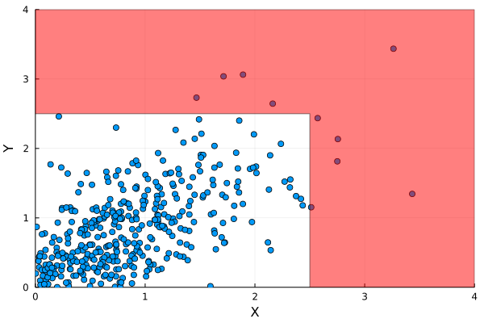
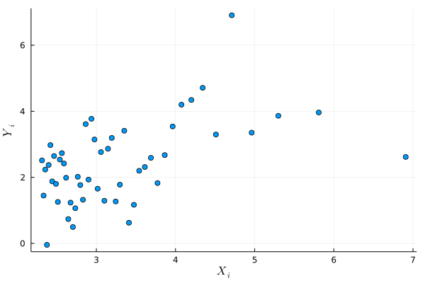

## The Heffernan-Tawn (HT) model

The HT model is useful for inferring
multivariate distributions in extreme regions - or in other words
for extrapolating beyond multivariate data. For example in the
following bivariate setting we could use HT to calculate
probabilities in the following red region where we have little data:

{.inlinegraph}

### How does it work?

Mathematically, working in a bivariate setting for convenience, assume we
have some data with Laplace$(1)$ margins
$\{(X_i, Y_i)\}_{i=1}^n\sim F(x,y)$. We make an assumption:

$$
\begin{aligned}
\exists \alpha=\alpha(x) \gt 0,\,\exists\beta=\beta(x) \text{ such that
} \\
  \prob\left(\frac{Y - \alpha x}{x^\beta} \leq z \middle\vert X = x\right)\rightarrow G(z) \text{ as } x\rightarrow \infty,
\end{aligned}
$$

where $G$ is non-degenerate. This initially looks like it has come out of thin
air, but it is not actually so unreasonable. [Keef et
al.](https://doi.org/10.1016/j.jmva.2012.10.012) showed that the above holds
for a large class of distributions (with Laplace margins).

The idea is to estimate $G$, $\alpha$ and $\beta$. Then you can estimate
probabilities such as $p = \prob(Y\in C|X > x)$ like so:

- generate $m$ samples $X_i$ from $X | X > x$ (remember that, after
  a possible transformation, $X$ has Laplace margins, so this is possible)
- generate $m$ samples $Z_i$ from $\hat G$
- then $\hat p = \frac{1}{m}\sum_{i=1}^m 1(Z_i x^{\hat\beta} + x\hat\alpha\in
  C)\approx p$ by LLN.

#### Estimating $G$, $\alpha$, $\beta$

For the above to work, we need to estimate $G$, $\alpha$ and $\beta$. The
approach taken by Heffernan and Tawn in their [original
paper](https://doi.org/10.1111/j.1467-9868.2004.02050.x) is an old favourite -
the normal assumption:

$$
\frac{Y - \alpha x}{x^\beta} \mid X = x \sim N(\mu, \sigma^2).
$$

The justification is unfortunately weak

>we [...] selected the Gaussian distribution for its simplicity, [and]
>superior performance in a simulation study

but we don't need to use the normal assumption when drawing from $G$ - we can
instead calculate $\hat G$, its empirical CDF, and draw using this. In other
words, we use a normal assumption to estimate a normalization for $Y$, but
estimate its distribution non-parametrically.

With this normal assumption, we can find MLEs $\hat\alpha$, $\hat\beta$,
$\hat\mu$ and $\hat\sigma$ by maximizing the log likelihood

$$
l(\alpha,\beta,\mu,\sigma) = -\sum_{i} \frac{1}{2}\log(2\pi\sigma^2 X_i^{2\beta})
-\sum_{i}\frac{1}{2\sigma^2 X_i^{2\beta}}\left(Y_i - \mu X_i^\beta - \alpha X_i\right)^2
$$

and find $\hat G$ with

$$
\begin{aligned}
\hat Z_i :&=  \frac{Y_i - \hat\alpha X_i}{X_i^{\hat\beta}},\\
\hat G(z) &= \frac{1}{n}\sum_{i=1}^n 1(\hat Z_i \leq z)
\end{aligned}
$$

### Example

We demonstrate that HT can be used to
extrapolate beyond normal data. In particular we generate
1000 samples from a bivariate normal:

$$
\{(X_i,Y_i)\}_{i=1}^{1000} \sim \text{BVN}\left(\mu=
\begin{pmatrix}
0\\
0
\end{pmatrix}, \Sigma=
\begin{pmatrix}
1 & 0.8\\
0.8 & 1\\
\end{pmatrix}
\right)
$$

and try to estimate (from the data alone, with no assumption about the
distribution of the data) $p = \prob(Y > \Phi^{-1}(0.99)| X >
\Phi^{-1}(0.99))\approx \prob(Y > 2.3 | X > 2.3)$. The point is that the event
$X > 2.3\cap Y > 2.3$ is unlikely (expected only 1\% of the time), and so this
probability cannot be measured accurately using a naive estimator like

$$
\hat p = \frac{\text{\# } (X_i,Y_i) \text{ s.t. } X_i >\Phi^{-1}(0.99) \text{ and } Y_i > \Phi^{-1}(0.99)}{\text{\# } (X_i,Y_i) \text{ s.t. } X_i >\Phi^{-1}(0.99)}
$$

since the number of samples would be too small.

##### Expected answer

For reference, the true answer is approximately $0.38$ with the following:

```{.julia}
Random.seed!(1)
u = quantile(Normal(), 0.99)
d = rand(MultivariateNormal(μ,Σ), 5_000_000) |> transpose |> collect
X = d[:,1]; Y = d[:,2]
p_est = sum((X .> u) .&& (Y .> u)) / sum(X .> u)
> 0.3754039461271351
```

We can use the naive estimator here because we have a large number of samples (5
million).

##### HT estimate

First, generate the dataset:

```{.julia}
data = rand(MultivariateNormal(μ,Σ), n) |> transpose|> collect
data = empirical_transform_copula(Laplace(), data)
xthresh_fit = quantile(Laplace(), 0.95)
ixs = data[:,1] .> xthresh_fit
X = data[ixs,1]; Y = data[ixs,2]
```
We make sure to transform to Laplace margins, as this is necessary
for fitting an HT model. We also arbitrarily pick a high threshold `xthresh` - _we
fit the HT model only on data greater than this threshold_.

{.inlinegraph}

Getting an HT model up and running is straightforward if you use
a numerical optimizer to maximize the likelihood above:

```{.julia}
ll(α,β,μ,σ) = loglikelihood.(Normal.(μ .* X .^ β .+ α .* X,σ .* X .^ β), Y) |> sum
lower = [-1, -Inf, -Inf, 0]
upper = [1, 1, Inf, Inf]
x_init = [0.5,0.1,1,1]
# optim minimizes by default, so take neg
Optim.optimize(x -> -ll(x...), lower, upper, x_init)
# yields α̂,β̂ etc.
```

The parameters to `Normal` come from the assumption
$Z = \frac{Y - \alpha x}{x^\beta} | X = x \sim N(\mu, \sigma^2)\implies Y | X =
x \sim  N(\mu x^\beta + \alpha x, \sigma^2 x^{2\beta})$. We search for $\alpha$
and $\beta$ in $[-1,1]$ and $(-\infty,1]$ respectively because of the bounds
in given in Section 2.2 Keef et al..

We can then draw samples from the HT model with

```{.julia}
n = 5_000_000;
a = cdf(Laplace(), 0.99)
X = quantile.(Laplace(), rand(Uniform(a, 1), n))
Z = Ginv.(rand(Uniform(), n)) # Ginv is the inverse of the empirical CDF for G
Y = Z .* X .^ β + α .* X
# at this point Y is in Laplace margins - you could transform back
# to your original margins if necessary
```

Finally, we can estimate $\prob(Y > \Phi^{-1}(0.99)| X > \Phi^{-1}(0.99))$ with

```{.julia}
u = quantile(Laplace(), 0.99)
p̂ = sum(Y .> u) / length(Y)
> 0.4161774
```
This estimate (0.42) is a slight overestimate, but it still demonstrates that
the extrapolation is possible.
