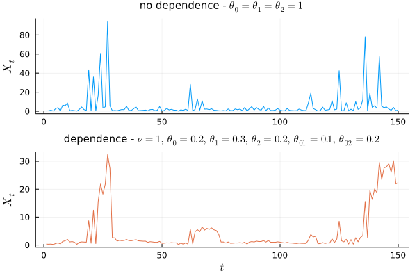

# Sampling from an asymmetric logistic model

Here, we inverse sample from a trivariate ($d=3$) extreme value
distribution $F=\exp^{-V}$. This is an asymmetric logistic model because
we choose $V$ to be an asymmetric logistic exponent measure.
An important takeaway is [this trick discussed below](#attempt-3).

See [this paper](https://rss.onlinelibrary.wiley.com/doi/10.1111/j.2517-6161.1991.tb01830.x)
for the motivation of the asymmetric logistic model.
Very roughly, it aims to model a large class of distributions while still being
interpretable. The model used here is also explored in
[this paper](https://arxiv.org/abs/1903.04059).

## Definitions

Define a joint probability distribution $F$ as follows:
$$
\begin{aligned}
F(\vec x) = \exp\left(-V(\vec x)\right),\, \vec x \in \R_{+}^3\\
\end{aligned}
$$

where

$$
\begin{aligned}
V(\vec x) &= \theta_0 x_0^{-1} + \theta_1 x_1^{-1} + \theta_2 x_2^{-1}\\
&+\theta_{01}\left\{(x_0^{-1/v_{01}} + x_1^{-1/v_{01}})^{v_{01}}
  + (x_1^{-1/v_{01}} + x_2^{-1/v_{01}})^{v_{01}}\right\}\\
&+\theta_{02}\left\{(x_0^{-1/v_{02}} + x_2^{-1/v_{02}})^{v_{02}}\right\}\\
&+\theta_{012}\left\{(x_0^{-1/v_{012}} + x_1^{-1/v_{012}} + x_2^{-1/v_{012}})^{v_{012}}\right\}\\
\\
&\theta_0+\theta_{01}+\theta_{02}+\theta_{012}=1\\
&\theta_1+2\theta_{01}+\theta_{012}=1\\
&\theta_2+\theta_{01}+\theta_{02}+\theta_{012}=1\\
&\vec v \lt 1.
\end{aligned}
$$

Note:

- the margins are all unit Fréchet: $F_{i}(x) |_{x_j=\infty,\,x_k=\infty} = \exp\left(-1/x\right)$
  because of the conditions on $\theta$;
- the components are independent if $\theta_{01}=\theta_{02}=\theta_{012} = 0$;
- we can induce dependence between $x_0$ and $x_2$, for example, by making
  $v_{02}$ small.

Define an order-2 Markov Chain:

$$
\begin{aligned}
X_0 &\sim F_{0}\text{ (this is univariate Fréchet)}\\
X_1|X_0 &\sim F_{1|0}\\
X_{t+2}|X_{t+1},X_{t}&\sim F_{2|0,1}.
\end{aligned}
$$

Then $(X_0,\,X_{1},\,X_{2})$ is a draw from $F$. $\{X_t\}$ is stationary
only if $\prob(X_0\leq x,\,X_1\leq y) = \prob(X_1\leq x,\,X_2\leq y)\iff
F(x,y,\infty)=F(\infty,x,y) \iff \theta_0 = \theta_2$ (this pops out after some
algebra). The conditions on $\theta$ imply $\theta_0 = \theta_2$.  It is then
not too hard to see that $X_t$ is stationary.

The aim is to draw samples from this order-2 Markov Chain.

## Implementation details

If we can draw samples from the conditional distributions of $F$ ($F_0,$
$F_{1|0},$ and $F_{2|0,1}$), then we can draw samples from the order-2 Markov
Chain. We use inversion sampling: $U\sim U[0,1]\implies F^{-1}(U)\sim F$ - in
other words, all we need are the conditional inverses.

- $F_0^{-1}$: this one is easy since $F_0(x) = \exp(-1/x)\implies F_0^{-1}(u) = -1/\log(u)$;
- $F_{1|0}^{-1}$: this one is less simple since we have to solve (for $x_0$)
  $F_{x_0}(x_0, x_1, \infty)/F_{x_0}(x_0,\infty,\infty) = u$ (here $F_{x_0}$ is the derivative w.r.t
  $x_0$). No analytical solution here.
- $F_{2|0,1}^{-1}$: also not simple, need to solve (for $x_2$)
  $F_{x_0\,x_1}(x_0,x_1,x_2)/F_{x_0\,x_1}(x_0,x_1,\infty) = u$.

We outline attempts to calculate $F_{1|0}^{-1}$ below, but similar methods can
be used to calculate $F_{2|0,1}^{-1}$.

#### Attempt 1

An initial idea is to use automatic differentiation to do all the hard work
(in lieu of calculating some tedious derivatives) and then use a root
solver. For $F_{1|0}$ this might look like:

```{.julia}
using Zygote
using Roots

V(x0,x1,x2) = ...
F(x0,x1,x2) = exp(-V(x0,x1,x2))
dF0(x0,x1)  = gradient(z -> F(z,x1,Inf), x0)[1]

F1_0(x,x0)     = dF0(x0,x)/dF0(x0,Inf)
F1_0_inv(u,x0) = fzero(x -> F1_0(x, x0) - u, 1)
```

This does vaguely work, and it is very short/simple! However it
struggles a lot solving $F_{1|0}(x;x_0) -u = 0$ when $u$ or $x_0$ are small.
For example, $x_0=0.001$ is enough to break it:

```{.julia}
julia> x0=1e-3;
julia> F1_0_inv(1,x0)
1.0
julia> F1_0_inv(0,x0)
1.0
```

#### Attempt 2

The main problem above is that we cannot calculate accurate gradients of $F$ at
small $x_0$:

```{.julia}
julia> dF0(x0,Inf)
0.0
julia> F1_0(0.5,x0)
NaN
```

and the reason for this is:

```{.julia}
julia> V(x0,Inf,Inf)
1000
julia> exp(-1000) ## == F(x0,Inf,Inf)
0.0               ## expect > 0. this zero
                  ## ruins subsequent multiplications
```

To resolve this, we can compute on a log scale, and then exponentiate at the end.
We use the result $F_{x_0} = -V_{x_0}\exp(-V)$, and work with derivatives of
$V$ rather than $F$ derivatives (i.e. we go a single level deeper):

```{.julia}
dV0(x0,x1,x2) = gradient(z -> V(z, x1, x2), x0)[1]
function F1_0(x, x0)
  # work on log scale and then exp up
  res = -V_(x0, x, Inf) + V_(x0, Inf, Inf)
  res += log(-dV0(x0, x, Inf))
  res -= log(-dV0(x0, Inf, Inf))
  exp(res)
end
F1_0_inv(u,x0) = fzero(x -> F1_0(x, x0) - u, 1)
```

This is an improvement, but we still stuggle with small $u$

```{.julia}
julia> F1_0_inv(0.1, x0)
0.30400613733225884
julia> F1_0_inv(1e-3, x0)
Roots.ConvergenceFailed("Algorithm failed to converge")
```

#### Attempt 3

To avoid convergence issues, we switch to a [bracketing
method](https://en.wikipedia.org/wiki/Root-finding_algorithms#Bracketing_methods)
in the root solver.
These are guaranteed to converge. Unfortunately, bracketing methods require
us to supply a finite interval in which to search for a zero, but we wish to
search over $x\in\R_+$. To get around
this, we instead solve

$$
F_{1|0}\left(\frac{x}{1-x};x_0\right) -u = 0,\quad{x\in (0,1)}
$$

Then the solution is $x' = x/(1-x)$. The trick here is that the root solver
searches in $[0,1]$, but we evaluate $F_{1|0}$ in $\R_+$.
This works since $x\mapsto x/(1-x)$ is a bijection from $[0,1]$ to $\R_+$.

```{.julia}
function F1_0_inv(u,x0)
  function f(x)
    y = x/(1-x)
    F1_0(y, x0)
  end
  res = fzero(f, (1e-8,1-1e-8))
  res/(1-res)
end

julia> F1_0_inv(1e-3, x0)
1.0000000100000002e-8

```
Nice!

In the end, it is more performant to do the algebra and code functions
for $\frac{\partial V}{\partial x_0}$ etc. by hand - though AD is
a good way to check the correctness of hand-written derivatives. Regardless,
the lessons from [Attempt 2](#attempt-2) and [Attempt 3](#attempt-3) are
still worth implementing.

#### Drawing samples

After battling the numerical issues above, it is easy to draw from the Markov
Chain:

```{.julia}
using Distributions

U = rand(Uniform(), n)
X = zeros(n)
X[1] = F0_inv(U[1])
X[2] = F1_0_inv(U[2], X[1])
for i ∈ 3:length(X)
  X[i] = F2_01_inv(U[i], X[i-2], X[i-1])
end
```

Below we see samples (using the same random seed) for the independent
and a dependent case:

{.inlinegraph}
