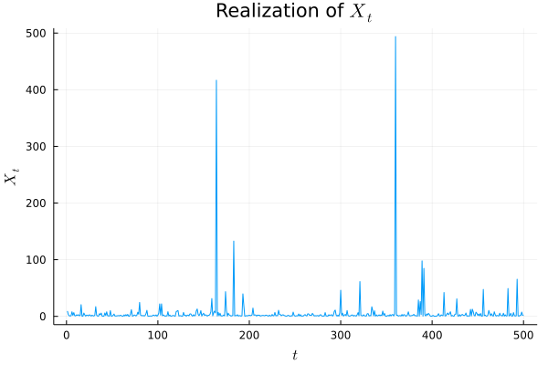
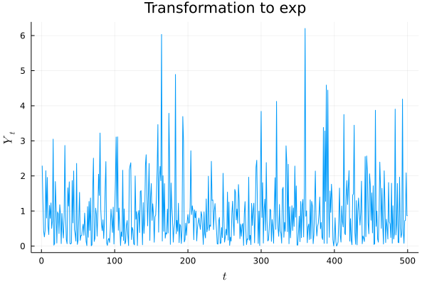
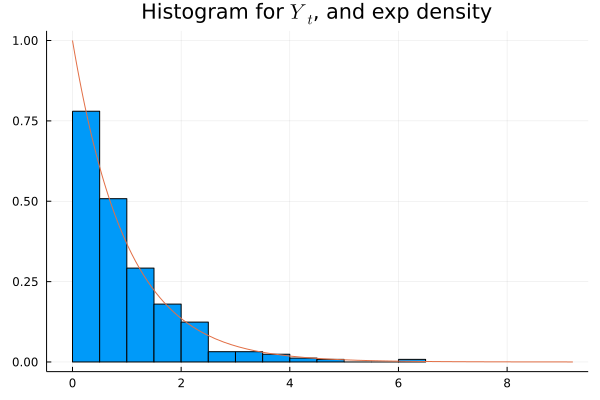
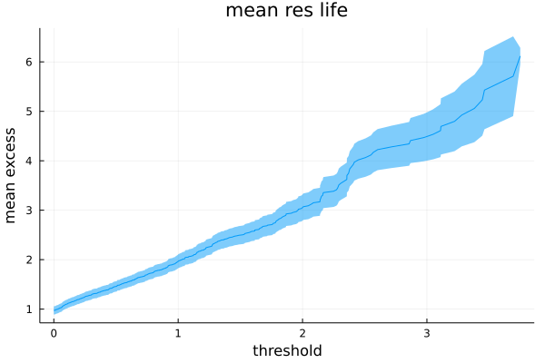
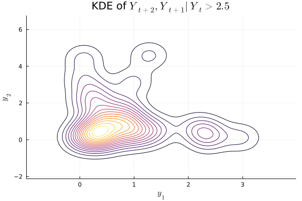

# Asymmetric logistic exponent measure

Here, we inverse sample from a trivariate ($d=3$) extreme value
distribution $F=\exp^{-V}$, where $V$ is an asymmetric logistic exponent
measure.

See this [paper](https://rss.onlinelibrary.wiley.com/doi/10.1111/j.2517-6161.1991.tb01830.x)
for the motivation of the asymmetric logistic model.
Very roughly, it aims to model a large class of distributions while still being
interpretable.

## Definitions

Define a joint probability distribution $F$ as follows:
$$
\begin{aligned}
F(\vec x) = \exp\left(-V(\vec x)\right),\, \vec x \in \R_{+}^3.\\
\end{aligned}
$$

where

$$
\begin{aligned}
V(\vec x) &= \theta_0 x_0^{-1} + \theta_1 x_1^{-1} + \theta_2 x_2^{-1}\\
&+\theta_{01}\left\{(x_0^{-1/v_{01}} + x_1^{-1/v_{01}})^{v_{01}}
  + (x_1^{-1/v_{01}} + x_2^{-1/v_{01}})^{v_{01}}\right\}\\
&+\theta_{02}\left\{(x_0^{-1/v_{02}} + x_2^{-1/v_{02}})^{v_{02}}\right\}\\
&+\theta_{012}\left\{(x_0^{-1/v_{012}} + x_1^{-1/v_{012}} + x_2^{-1/v_{012}})^{v_{012}}\right\}\\
\\
&\theta_0+\theta_{01}+\theta_{02}+\theta_{012}=1\\
&\theta_1+2\theta_{01}+\theta_{012}=1\\
&\theta_2+\theta_{02}+\theta_{12}+\theta_{012}=1\\
&\vec v \lt 1.\\
\end{aligned}
$$

Note:

- the margins are Fréchet: $F_{i}(x) |_{x_j=\infty,\,x_k=\infty} = \exp\left(-c_i/x\right)$;
- the components are independent if $\theta_{01}=\theta_{02}=\theta_{012} = 0$;
- we can induce dependence between $x_0$ and $x_2$, for example, by making
  $v_{02}$ small.

Define an order-2 Markov Chain:

$$
\begin{aligned}
X_0 &\sim F_{0}\text{ (this is univariate Fréchet)}\\
X_1|X_0 &\sim F_{1|0}\\
X_{t+2}|X_{t+1},X_{t}&\sim F_{2|0,1}
\end{aligned}
$$

Then $(X_t,\,X_{t+1},\,X_{t+2})$ is a draw from $F$. It is clear that $\{(X_t,\,X_{t+1},\,X_{t+2})\}_t$
are i.d. but not i.i.d..

## Implementation details

#### Identities

$$
\begin{aligned}
F_{1|0}&=\pdiff{F}{x_0}\Big|_{x_2=\infty}\Big /\pdiff{F}{x_0}\Big|_{x_1=x_2=\infty}= \frac{F(x_0, x_1, \infty)}{F(x_0, \infty, \infty)}\frac{\pdiff{V}{x_0}\big|_{x_2=\infty}}{\pdiff{V}{x_0}\big|_{x_1=x_2=\infty}}\\
F_{2|0,1}&=\frac{\partial^2 F}{\partial{x_0}\partial{x_1}}\Big/\frac{\partial^2 F}{\partial{x_0}\partial{x_1}}\Big|_{x_2=\infty}\\
&=\frac{F(x_0, x_1, x_2)}{F(x_0,x_1,\infty)}\frac{\pdiff{V}{x_0}\pdiff{V}{x_1} - \frac{\partial^2 V}{\partial{x_0}\partial{x_1}}}{\pdiff{V}{x_0}|_{x_2=\infty}\pdiff{V}{x_1}|_{x_2=\infty} - \frac{\partial^2 V}{\partial{x_0}\partial{x_1}}|_{x_2=\infty}}\\
\end{aligned}
$$

#### Drawing r.v's

To simulate the above Markov Chain, we need to draw from $F_0,\,F_{1|0}$
and $F_{2|0,1}$. We'll do this using inverse sampling. For $F_0$ this is easy,
because its inverse can be written down explicitly:

$$
F_0^{-1}(u) = -\frac{\theta_0 + \theta_{01}+\theta_{02} + \theta_{012}}{\log u}.
$$

To invert $F_{1|0}$, solve for $x$:

$$
\begin{aligned}
F_{1|0}(x;x_0) &= u\\
\iff u&= -\pdiff{V}{x_0}\Big|_{x_2=\infty}\exp(-V)\\
\iff 0&= \log u + V -\log\left(-\pdiff{V}{x_0}\right)
\end{aligned}
$$

Similarly for $F_{2|0,1}$.

#### Transforming margins

In general given an r.v. $\vec X \sim G$
we can transform its margins to $H$ with $x\mapsto H^{-1}(G_i(x))$
since

$$
\prob(H^{-1}(G_i(X_i)) \leq x) = \prob(X_i \leq G_i^{-1}(H(x))) =
G_i(G_i^{-1}(H(x))) = H(x).
$$

We wish to transform the order-2 MC data to $\text{Exp}(1)$ margins,
so we need to calculate $-\log(1-F_{2|0,1}(X_t))$, for $t \geq 2$.

#### Independent Case

Generate realizations:

{.inlinegraph}

Map to exponential:

{.inlinegraph}

Sanity check (shows that the code for generating $X_t$ is not obviously incorrect)

{.inlinegraph}

Mean residual life plot. We want to find a suitable $u$ for which to consider
$Y_{t+2},\,Y_{t+1}|Y_t > u$ (though since we are in the independent case,
it really ought not to matter)

{.inlinegraph}

Density of $Y_{t+2},\,Y_{t+1}|Y_t > u$:

{.inlinegraph}
