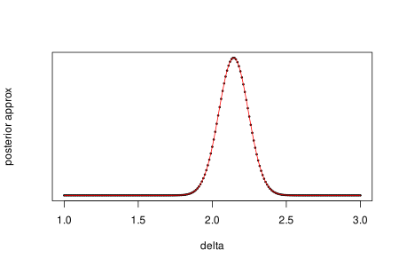

# Basic state space model

Imagine the following process:

$$
x_t = x_{t-1} + \epsilon_t\\
y_t = g(x_t) + \nu_t
$$

where $\epsilon_t\sim N(0, \sigma_x^2)$ iid and $\nu_t\sim N(0, \sigma_y^2)$ iid.

This model could be motivated if we take $x_t$ to be the actual
(unknown) temperature at some location, and $y^i_t$ as temperature readings
according to some thermometers.

# Performing inference on $g$

Consider a simple case where $g(x) = \delta + x$ for some unknown $\delta.$
Maybe we suspect that our thermometer has a bias? Write $\theta$ for our
unknown variables (i.e. $\theta = (\delta, \sigma_x^2, \sigma_y^2)$).  Given
some prior $\pi(\theta)$, we can use Bayesian theory to try and infer something
about $\delta$ by obtaining a posterior:

$$
\lbrace y_1,\cdots,y_T\rbrace := y_{1:T}\\\\
p(\theta | y_{1:T}) \propto p(y_{1:T} | \theta)\pi(\theta)\\
=\int_{x_{1:T}}p(y_{1:T}, x_{1:T}|\theta)\pi(\theta)\d x_{1:T}\\
=\int_{x_{1:T}}p(y_{1:T}|x_{1:T}, \theta)p(x_{1:T}|\theta)\pi(\theta)\d x_{1:T}\\
\approx \frac{1}{N}\sum^N_{i=1} p(y_{1:T}|x^{(i)}_{1:T}, \theta)
p(x^{(i)}_{1:T}|\theta)\pi(\theta).
$$

Here we're summing over some randomly generated samples $x^{(i)}_{1:T}.$

In our case, generating samples of $x_{1:T},$ is not possible directly because
it depends on $\theta$ (in particular it depends on $\sigma_x^2$).
We don't know what $\sigma_x^2$ is, but we can select a prior and sample
$\sigma_x^2$ from that.

Since $x_t$ depends only on $x_{t-1}$ (it is a Gaussian random walk),
we have

$$
p(x_{1:T} | \sigma_x^2) = p(x_1|\sigma_x^2)p(x_2|x_1,\sigma_x^2)\cdots
p(x_T|x_{T-1},\sigma_x^2),
$$

which is a product of Gaussian densities. Also

$$
p(y_{1:T} | x_{1:T}^{(i)}, \theta) =
\left(\frac{1}{2\pi \sigma_y^2} \right)^T\exp\left(-\frac{1}{2\sigma_y^2}\sum_{j=1}^T
(y_j - (\delta + x^{(i)}_j))^2\right).
$$

Similarly as for $\sigma_x^2,$ we can sample $\sigma_y^2$ from a prior if we
need to.

## Inference in practice

In theory, the above gives us all we need to obtain a posterior likelihood. In
practice, I found that if $T$ gets too large, then the numerous products of
small terms can cause rounding errors (these terms can eventually get rounded to
zero!).  One hack around this is to work with the likelihood rather than the
posterior (meaning we can multiply the posterior expression by any constant),
and aim to set up products of numbers that are $O(1).$

To test that this at least somewhat works, I generated some $y$'s with
$T=50;\sigma_y^2=0.5;\sigma_y^2=0.5;\delta=2,$ and then tried to reverse
engineer $\delta.$ I chose $\pi(\sigma_x^2)\sim\text{Exp}(2),$ and for
convenience I selected the improper uniform prior for $\delta,$ and assumed that
I knew $\sigma_y^2$ (this is probably not realistic). Unfortunately the output
varies quite a lot, but we can at least plot an approximate density for $\delta:$

R code [here](experiment.R). One further avenue of exploration might be to split
$y_{1:T}$ into several chunks, e.g. $\lbrace y_{1:10},
y_{6:15},\cdots,y_{41:50}\rbrace,$ in order to obtain several posteriors for the
same data, and take an average (this would diminish the small number rounding
problem).