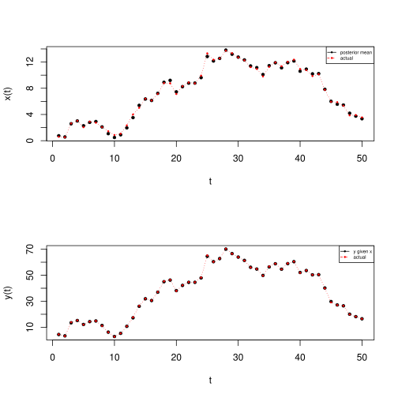

# Bootstrap particle filter implementation

_This is an implementation of the 'boostrap filter' (aka BF) as detailed in
[this paper](https://arxiv.org/pdf/1911.01383.pdf)._ It is also an improvement
on a [previous post](../basic-state-space-model/index.md).

Consider the state-space model distributions (see section 2.1 in the paper)

$$
\begin{aligned}
X_0 & \sim p(x_0)\\
X_t & \sim p(x_t | x_{t-1})\\
Y_t & \sim p(y_t | x_t).
\end{aligned}
$$

Assume we have some time series data $y_{1:t} := \{ y_1, \cdots, y_t\}.$
Particle filtering is all about finding $p(x_t | y_{1:t}).$ Example: $y_t$
is the measured number of people with a certain disease, and we are modelling
$x_t,$ the _actual_ number of people with said disease.

## $p(x_t | y_{1:t})$ decomposition

This is declared in the paper, but we derive it here.

By applying Bayes' theorem, noting that terms containing only $y$'s
are just constants w.r.t $x$, and using modelling assumptions:

$$
p(x_t | y_{1:t}) \propto p(x_t, y_{1:t})\\
=       \int p(x_t, x_{t-1}, y_{1:t})\d x_{t-1}\\
\propto \int p(x_t, x_{t-1} | y_{1:t})\d x_{t-1}\\
\propto p(y_t | y_{1:t-1})\int p(x_t, x_{t-1}, y_t | y_{1:t-1}) \d x_{t-1}\\
\propto \int p(x_t, y_t | y_{1:t-1}, x_{t-1})p(x_{t-1} | y_{1:t-1}) \d x_{t-1}\\
\propto p(y_t | x_t) \int p(x_t | x_{t-1})p(x_{t-1} | y_{1:t-1}) \d x_{t-1}.
$$

## BF intuition

BF uses the above decomposition.  BF is recursive; the
idea is to assume that we have some estimate for $p(x_{t - 1} | y_{1:t-1}),$ and
some 'particles' (aka samples) for $X_{t-1}.$ We can draw particles for $X_t,$
because we know $p(x_t | x_{t-1})$ (it is a modelling assumption). To find which
particles are likely, given our measurement $y_t,$ we do some re-weighting with
the likelihood $p(y_t | x_t)$ - this gives us an approximation for $p(x_t |
y_{1:t})!$

## BF Implementation

The implementation is simple in R, once you have defined a model (i.e.
you can implement `draw_xs` and `draw_weights`):

```
bf <- function(ys, draw_xs, draw_weights, M) {
    # BF implementation in 1 dimension
    #
    # params:
    #   ys:           time series \in R^{T x 1}
    #   draw_xs:      draws M particles from p(x_t | x_t-1)
    #   draw_weights: returns probability vector based on the likelihood p(y_t | x_t)
    #   M:            number of particles to draw
    T <- length(ys)

    # ps = particles
    # there is some arbitrariness in the initial particle choice
    prev_ps <- draw_xs(rep(0, M))
    ps <- matrix(, nrow=M, ncol = T)

    for(i in 1:T) {
        new_ps <- draw_xs(prev_ps)
        ws <- draw_weights(ys[i], new_ps)
        new_ps_weighted <- sample(new_ps, size=M, replace=TRUE, prob=ws)

        prev_ps <- new_ps_weighted
        ps[, i] <- prev_ps
    }
    ps
}
```

## Testing

Code [here](./filter.r).

To test the implementation, define the following state-space model:

$$
\begin{aligned}
X_0        & = & 0\\
X_t        & = & f(X_{t-1}) + \epsilon_t\\
Y_t        & = & g(X_t) + \nu_t\\
\epsilon_t & \sim_{\text{iid}} & N(0, 1^2)\\
\nu_t      & \sim_{\text{iid}} & N(0, 1^2)\\
t          & \in &\{ 1, \cdots, 50\}.
\end{aligned}
$$

BF can handle arbitrary $f$ and $g$! As a sanity check, we'll set $f(x) = x,$
and check that the posterior means for $x$ look sensible
(the posterior mean for $x_t$ is just the mean of the particles $x_t^{(m)}$);
we also compare the actual values of $y$ with estimators for $y$ given our
estimators for $x.$

### $g(x) = 5x + \mathrm{sin}(x):$



### $g(x) = \mathrm{e}^x:$


BF seems to predict $x$ well when $g$ has a small gradient, but struggles a bit
more when the gradient is large. This makes sense, because if the gradient of
$g$ is large, small changes caused by our random variables $\epsilon,\nu$ could
drastically change the data $y.$

## Attributions

[[link]](https://arxiv.org/pdf/1911.01383.pdf) V. Elvira, J. Miguez,
P. M. Djuric,
"On the performance of particle filters with adaptive number of particles", to appear in Statistics and Computing, 2021.
